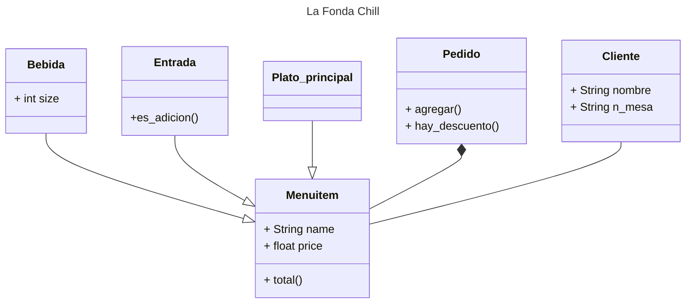

# Programación Orientada a Objetos: Reto 3

En este repositorio están las soluciones al reto de la clase 8 del planteado en [la clase n°8](https://github.com/fegonzalez7/poo_unal_clase8).

### Planteamiento del Reto: 

1. Create a repo with the class exercise
2. **Restaurant scenario:** You want to design a program to calculate the bill for a customer's order in a restaurant.
- Define a base class *MenuItem*: This class should have attributes like name, price, and a method to calculate the total price.
- Create subclasses for different types of menu items: Inherit from *MenuItem* and define properties specific to each type (e.g., Beverage, Appetizer, MainCourse). 
- Define an Order class: This class should have a list of *MenuItem* objects and methods to add items, calculate the total bill amount, and potentially apply specific discounts based on the order composition.

Create a class diagram with all classes and their relationships. 
The menu should have at least 10 items.
The code should follow PEP8 rules.

## LA FONDA CHILL 

Este es un restaurante planteado como una *FONDA*, un restaurante familiar básado en las recetas de la abuela, en este caso las peores que se me pueden ocurrir expecto por una que otra opción.
 
Para eso formulé la siguiente lógica: 

